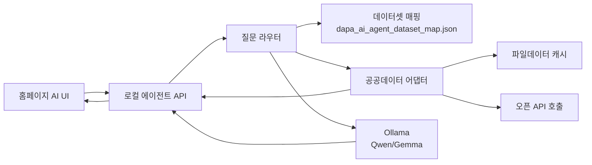

# 방위사업청 AI 에이전트 연동 명세

작성일: 2026-05-20

## 범위

현재 단계는 공공데이터 원문과 LLM 모델을 직접 탑재하지 않는다. 대신 `dapa_ai_agent_home_prototype.html`이 향후 로컬 서버, 공공데이터 어댑터, Ollama 기반 Qwen/Gemma 모델과 연결될 수 있도록 프론트엔드 계약을 정의한다.

## 현재 산출물 역할

| 파일 | 역할 |
|---|---|
| `dapa_ai_agent_home_prototype.html` | 방위사업청 메인 탑재형 AI 에이전트 UI 프로토타입 |
| `dapa_ai_agent_dataset_map.json` | 44개 데이터셋의 목차·하위목차·역할 매핑 |
| `dapa_public_data_inventory.csv` | 원본 데이터셋 인벤토리 |
| `dapa_ai_agent_ui_plan.md` | UI/UX 계획과 참고 패턴 |

## 권장 로컬 아키텍처



## 프론트엔드가 서버에 보내야 할 요청

엔드포인트 예시:

```http
POST /api/agent/chat
Content-Type: application/json
```

요청 바디:

```json
{
  "question": "국외조달 입찰공고와 과거 계약정보를 같이 비교해줘.",
  "audience": "company",
  "sectionId": "procurement",
  "subsectionId": "notice",
  "filters": {
    "activeOnly": true,
    "language": "ko"
  },
  "selectedDatasets": [
    {
      "type": "FILE",
      "title": "방위사업청_국외조달 입찰공고"
    },
    {
      "type": "API",
      "title": "방위사업청_군수품조달정보 입찰공고"
    }
  ]
}
```

필드 설명:

| 필드 | 설명 |
|---|---|
| `question` | 사용자의 자연어 질문 |
| `audience` | `company`, `citizen`, `staff` 중 하나 |
| `sectionId` | `terms`, `law`, `procurement`, `domestic`, `overseas` 중 하나 |
| `subsectionId` | 군수품 조달정보에서만 사용: `plan`, `notice`, `result`, `contract` |
| `filters.activeOnly` | 입찰공고 질문에서 진행 중인 공고 우선 여부 |
| `selectedDatasets` | UI가 현재 선택한 데이터셋 목록 |

## 서버가 프론트엔드에 반환해야 할 응답

```json
{
  "answer": "현재 국외조달 입찰공고는 최신 API 조회가 필요하고, 과거 계약정보는 파일데이터 기준 분석이 적합합니다...",
  "summaryCards": [
    {
      "title": "최신 조회",
      "body": "입찰공고 API를 통해 마감 전 공고를 우선 확인합니다."
    },
    {
      "title": "이력 분석",
      "body": "국외조달 계약정보 파일로 과거 계약규모와 품목을 비교합니다."
    },
    {
      "title": "다음 행동",
      "body": "공고번호, 품목명, 발주기관 기준으로 범위를 좁힙니다."
    }
  ],
  "sources": [
    {
      "type": "API",
      "title": "방위사업청_군수품조달정보 입찰공고",
      "basis": "실시간 조회",
      "retrievedAt": "2026-05-20T23:40:00+09:00"
    },
    {
      "type": "FILE",
      "title": "방위사업청_국외조달 계약정보",
      "basis": "파일데이터 분석",
      "dataAsOf": "2025-12-31"
    }
  ],
  "suggestedQuestions": [
    "이 공고와 유사한 과거 낙찰 결과를 비교해줘.",
    "참여 가능한 업체 조건을 알려줘."
  ],
  "warnings": [
    "파일데이터는 기준일 이후 변경사항을 포함하지 않을 수 있습니다."
  ]
}
```

## Ollama 호출 계약

Ollama 직접 호출 예시:

```http
POST http://localhost:11434/api/chat
Content-Type: application/json
```

```json
{
  "model": "qwen2.5:7b",
  "stream": false,
  "messages": [
    {
      "role": "system",
      "content": "너는 방위사업청 공개데이터를 설명하는 공공서비스 AI 에이전트다. 답변은 쉽고 근거 중심으로 작성한다. 파일데이터와 오픈 API의 기준을 구분한다."
    },
    {
      "role": "user",
      "content": "사용자 유형: 방산업체\n목차: 군수품 조달정보 > 입찰공고\n질문: 현재 참여 가능한 입찰공고를 찾아줘.\n사용 데이터셋: 방위사업청_국내조달 경쟁 입찰공고, 방위사업청_군수품조달정보 입찰공고"
    }
  ]
}
```

모델 후보:

| 모델 | 권장 용도 |
|---|---|
| `qwen2.5:7b` 또는 `qwen3:8b` | 한국어 질의응답, 요약, 도메인 설명 |
| `gemma3:12b` | 한국어 설명 품질과 안정성을 우선할 때 |
| 더 큰 Qwen/Gemma | 내부 장비 성능이 충분하고 긴 컨텍스트가 필요할 때 |

## 데이터 어댑터 원칙

| 데이터 유형 | 처리 방식 |
|---|---|
| 파일데이터 | CSV/XLSX/PDF/HWPX를 별도 수집·정제 후 검색 인덱스 또는 RAG 컨텍스트로 제공 |
| 오픈 API | 질문 시점에 필요한 최신 항목만 호출 |
| GW API | 기존 API와 중복 가능성이 있으므로 운영 환경에서 우선순위 결정 |
| 법제처 API | 법령해석 목록과 본문을 분리 조회 |

## 답변 정책

1. 답변 첫머리에 사용자가 이해할 수 있는 결론을 제시한다.
2. `파일데이터 기준`과 `오픈 API 최신 조회`를 구분한다.
3. 방산업체에는 참여 가능성, 준비 항목, 관련 공고를 우선한다.
4. 국민에게는 쉬운 설명과 공개 근거를 우선한다.
5. 직원에게는 데이터 출처, 기준일, 업무 판단 근거를 우선한다.
6. 보안상 비공개 정보, 추정 계약정보, 내부 의사결정 정보는 생성하지 않는다.
7. 알 수 없는 정보는 “공개 데이터 기준으로 확인되지 않음”이라고 답한다.

## UI 상태와 오류 처리

| 상태 | UI 표시 |
|---|---|
| 모델 미연결 | `모델 미연결 · 화면 기능 구현` |
| Ollama 연결됨 | `로컬 LLM 연결됨` |
| API 호출 실패 | 답변 하단에 `일부 API 조회 실패` 경고 |
| 파일 기준일 오래됨 | `파일데이터 기준일 확인 필요` 경고 |
| 출처 없음 | 답변 생성 금지 또는 “공개 데이터 기준 확인 불가” |

## 개인정보·보안 원칙

1. 브라우저 `localStorage`와 `sessionStorage`에 질문·답변을 저장하지 않는다.
2. 서버 로그에도 원문 질문을 장기 보관하지 않는 구성이 바람직하다.
3. API 키는 프론트엔드에 노출하지 않는다.
4. 내부망 LLM으로 전환할 경우 외부 API 호출 여부를 설정으로 분리한다.
5. 공개 데이터 범위를 벗어난 조언은 제한한다.

## 구현 순서

1. `dapa_ai_agent_dataset_map.json`을 프론트엔드와 서버에서 공통 로드한다.
2. `/api/agent/chat` 로컬 엔드포인트를 만든다.
3. 파일데이터 검색 어댑터를 붙인다.
4. 오픈 API 호출 어댑터를 붙인다.
5. Ollama `/api/chat` 호출을 붙인다.
6. 응답의 `answer`, `summaryCards`, `sources`, `warnings`를 현재 UI 컴포넌트에 연결한다.
7. 사용자 유형별 프롬프트를 조정한다.
