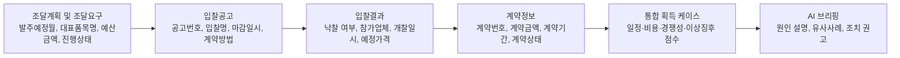

# DAPA 획득체계 통합관제 서비스 초안

## 1. 서비스 목표

`DAPA 획득체계 통합관제 서비스`는 조달계획 및 조달요구, 입찰공고, 입찰결과, 계약정보를 하나의 획득 로드맵으로 연결해 사업담당자가 일정·비용·성능·경쟁성 리스크를 조기에 확인하도록 돕는 AI 기반 의사결정 서비스다.

핵심 목표는 다음이다.

- 경험 많은 담당자의 암묵지를 데이터 기반 판단 체계로 전환
- 신규 담당자도 사업 리스크를 한 화면에서 이해
- 엑셀 수작업, 유사사례 검색, 보고자료 초안 작성 시간 절감
- 유찰, 지연, 경쟁 부족, 비용 괴리, 이상 낙찰 위험을 조기 탐지

## 2. LLM이 필요한 기능

### 2.1 사업 리스크 원인 요약

입력:

- 조달계획, 입찰공고, 입찰결과, 계약정보 연결 데이터
- 리스크 점수
- 유사사업 비교 결과

출력:

- 위험 수준 요약
- 주요 원인 3~5개
- 담당자 확인 필요 항목
- 추천 조치

예시:

> 이 사업은 경쟁 부족과 일정 지연 위험이 높습니다. 유사 품목의 참여업체 수가 감소했고, 공고부터 계약까지 평균보다 24일 더 소요되었습니다. 공고 전 참가자격 조건과 대체 업체 후보군을 확인해야 합니다.

### 2.2 유사사업 비교 설명

LLM은 검색 모델이 찾은 유사사업 목록을 받아 현재 사업과 비교한다.

- 어떤 점이 유사한지
- 어떤 리스크가 반복되는지
- 과거 사업에서 어떤 조치가 필요했는지
- 현재 사업에 적용할 수 있는 점은 무엇인지

### 2.3 공고 품질 개선 제안

입찰공고 정형 데이터와, 가능하다면 공고문 텍스트를 기반으로 점검한다.

- 마감기간이 과도하게 짧은가
- 계약방법이 유사 품목 대비 제한적인가
- 참가자격이 경쟁을 줄일 가능성이 있는가
- 반복 유찰 품목과 유사한 조건인가

### 2.4 의사결정 브리핑 생성

사업담당자가 회의 전에 바로 사용할 수 있는 1페이지 요약을 생성한다.

포함 항목:

- 사업 개요
- 현재 단계
- 종합 리스크
- 일정·비용·성능·경쟁성 리스크
- 유사사업
- 조치 권고
- 데이터 출처와 기준일

### 2.5 질의응답

담당자가 자연어로 질문하면 근거 데이터 중심으로 답한다.

예시 질문:

- 이 사업의 가장 큰 리스크는 무엇인가?
- 왜 경쟁 부족 위험이 높은가?
- 유사한 과거 계약은 무엇인가?
- 공고 전에 무엇을 확인해야 하는가?
- 일정 지연 가능성을 낮추려면 어떤 조치가 필요한가?

## 3. 데이터 수집 및 처리 방식

## 3.0 획득유형 구분 적용

무기체계 획득 업무는 국내구매, 국외구매, 연구개발, 양산으로 구분해 보는 것이 타당하다. 서비스에는 `획득유형(acquisition_type)` 필드를 두고 모든 리스크 점수와 유사사업 검색을 획득유형별로 분리한다.

| 획득유형 | 공개데이터 기반 판별 방법 | 리스크 관리 관점 |
| --- | --- | --- |
| 국내구매 | 조달계획·입찰공고·계약정보의 국내 목록, 계약방법, 집행유형, 업무구분 활용 | 경쟁 부족, 유찰, 낙찰률, 납기 지연 |
| 국외구매 | 조달계획·입찰공고·계약정보의 국외 목록, 해외입찰정보, 국외 조달계획 활용 | 환율·납기·원문 조건·국외 공급망·수출통제 유사 이슈 |
| 연구개발 | 사업명·계약명에 연구개발, 체계개발, 시제, 개발, 성능개량 등 키워드가 포함되는 경우 1차 분류 | 기술성숙도, 성능 요구 변경, 시험평가 일정, 개발 지연 |
| 양산 | 사업명·계약명에 양산, 초도양산, 후속양산, 물량, 생산 등 키워드가 포함되거나 계약기간·계약금액이 반복 생산형인 경우 1차 분류 | 단가 안정성, 생산능력, 품질, 납품 일정, 업체 집중도 |

완전 자동판별이 어려운 건은 `분류 신뢰도`를 표시하고 담당자가 확정할 수 있도록 한다.

## 3.1 데이터 로드맵



## 3.2 필수 공공데이터

| 단계 | 데이터 | 수집 방식 | 주요 필드 | 처리 |
| --- | --- | --- | --- | --- |
| 조달계획 및 조달요구 | 방위사업청_군수품조달정보 조달계획 | OpenAPI | 발주예정월, 판단번호, 대표품목명, 계약방법, 입찰방법, 발주기관, 예산금액, 진행상태 | 월 단위 수집, 품목명 정규화 |
| 입찰공고 | 방위사업청_군수품조달정보 입찰공고 | OpenAPI | 공고번호, 입찰명, 공고일자, 입찰마감일시, 개찰일시, 계약방법, 업무구분 | 공고번호 기준 연결 |
| 입찰결과 | 방위사업청_군수품조달정보 입찰결과 | OpenAPI | 낙찰 여부, 참가업체, 개찰일시, 예정가격, 계약방법, 입찰방법 | 참가업체 수와 낙찰 패턴 산출 |
| 계약정보 | 방위사업청_군수품조달정보 계약정보 | OpenAPI | 계약번호, 계약명, 계약업체명, 계약금액, 예정가격, 계약기간, 계약상태 | 계약금액·기간·낙찰률 분석 |
| 업체 보강 | 방위사업청 국내조달 입찰참여업체정보 | CSV 또는 자동 변환 API | 업체명, 대표자명 | 업체명 정규화, 반복 참여 분석 |
| 방산업체 보강 | 방위사업청_방산업체 지정현황 | CSV 또는 자동 변환 API | 업체명, 분야, 지정일자 | 방산 분야별 업체 풀 구성 |

## 3.3 실제 구현 데이터 처리

### 수집

1. 공공데이터포털에서 OpenAPI 활용신청
2. 서비스키 발급
3. 3~5년 데이터를 월 단위로 호출
4. `numOfRows`, `pageNo`로 페이지네이션 처리
5. 원천 응답을 `raw` 테이블에 저장

### 정규화

1. 날짜를 `YYYY-MM-DD`로 통일
2. 금액 필드를 숫자형으로 변환
3. 기관명, 업체명, 품목명 공백·특수문자 제거
4. 주식회사, 유한회사, 괄호 표기 등 업체명 접미어 정리
5. 계약방법, 입찰방법, 업무구분 코드를 표준 분류로 매핑

### 연결

1. 입찰공고번호, 공고차수, 계약번호 등 정확 키 우선 연결
2. 정확 키가 없는 경우 품목명·사업명·기관명·날짜 범위로 후보 연결
3. 텍스트 유사도와 날짜 차이를 결합해 연결 신뢰도 산출
4. 연결 신뢰도 80% 미만은 수동 검토 대상으로 표시

### 리스크 점수 산출

| 점수 | 산출 예시 |
| --- | --- |
| 일정 리스크 | 발주예정월 대비 공고일자 지연, 공고일자 대비 계약일자 지연 |
| 비용 리스크 | 예산금액, 예정가격, 계약금액, 낙찰률의 유사군 대비 편차 |
| 경쟁 리스크 | 유사 품목 평균 참여업체 수, 단일 참여 여부, 반복 유찰 여부 |
| 이상 낙찰 리스크 | 낙찰률 이상값, 동일 업체 반복 낙찰, 특정 계약방법 집중 |
| 성능 관리 리스크 | 공고·계약 단계에서 품목명세서 변경 또는 계약기간 증가 신호 |

## 4. 단계별 실행계획 TODO

### 1단계. 데이터 확보

- [ ] 공공데이터포털 계정 준비
- [ ] 조달계획 OpenAPI 활용신청
- [ ] 입찰공고 OpenAPI 활용신청
- [ ] 입찰결과 OpenAPI 활용신청
- [ ] 계약정보 OpenAPI 활용신청
- [ ] 입찰참여업체정보 CSV 다운로드
- [ ] 방산업체 지정현황 CSV 다운로드

### 2단계. 데이터 수집기 구현

- [ ] 월 단위 API 호출 스크립트 작성
- [ ] 페이지네이션 처리
- [ ] API 오류 재시도 로직 구현
- [ ] 원천 JSON/XML 저장
- [ ] CSV 인코딩 자동 판별
- [ ] 수집 기준일 기록

### 3단계. 데이터 정규화

- [ ] 날짜 필드 표준화
- [ ] 금액 필드 숫자 변환
- [ ] 품목명 정규화
- [ ] 업체명 정규화
- [ ] 기관명 정규화
- [ ] 계약방법·입찰방법 표준 코드화

### 4단계. 데이터 연결

- [ ] 공고번호 기반 입찰공고-입찰결과 연결
- [ ] 계약번호 기반 계약정보 연결
- [ ] 품목명·사업명 유사도 기반 조달계획-공고 후보 연결
- [ ] 개찰일자-계약일자 날짜 윈도우 검증
- [ ] 연결 신뢰도 점수 산출
- [ ] 연결 실패 건 수동 검토 목록 생성

### 5단계. 리스크 모델 구현

- [ ] 일정 지연 지표 구현
- [ ] 비용 괴리 지표 구현
- [ ] 경쟁 부족 지표 구현
- [ ] 이상 낙찰 지표 구현
- [ ] 성능 관리 보조 지표 구현
- [ ] 종합 리스크 점수 산식 정의

### 6단계. LLM 브리핑 구현

- [ ] 사업별 리스크 요약 프롬프트 작성
- [ ] 유사사업 비교 프롬프트 작성
- [ ] 담당자 체크리스트 생성 프롬프트 작성
- [ ] 데이터 출처와 기준일을 함께 출력
- [ ] LLM 답변에 근거 필드 포함

### 7단계. 화면 구현

- [ ] 통합 대시보드
- [ ] 획득 로드맵
- [ ] 리스크 게이지
- [ ] 단계별 리스크 바
- [ ] 리스크 원인 설명
- [ ] 유사사업 목록
- [ ] AI 브리핑
- [ ] 보고서 출력

### 8단계. 검증

- [ ] 과거 유찰 사례가 고위험으로 잡히는지 확인
- [ ] 과거 지연 계약이 일정 리스크로 잡히는지 확인
- [ ] 반복 낙찰 업체가 이상패턴으로 잡히는지 확인
- [ ] 담당자 피드백으로 산식 보정

## 5. 시각화 방식

## 5.1 획득 로드맵

화면 중앙에는 다음 흐름을 고정으로 보여준다.

```text
조달계획 및 조달요구 → 입찰공고 → 입찰결과 → 계약정보
```

각 단계는 다음 정보를 포함한다.

- 현재 상태
- 주요 날짜
- 핵심 금액
- 담당 기관
- 단계별 리스크 바
- 원천 데이터 연결 여부

## 5.2 종합 리스크 게이지

사업별 종합 리스크를 0~100점으로 표시한다.

- 0~39: 낮음
- 40~54: 관찰
- 55~74: 주의
- 75~100: 높음

## 5.3 리스크 원인 바 차트

리스크 원인을 막대그래프로 보여준다.

- 참여업체 감소
- 공고-계약 기간 증가
- 예산 대비 계약금액 편차
- 동일 업체 반복 낙찰
- 품목명 매칭 신뢰도

## 5.4 담당자 확인 체크리스트

AI가 위험 원인별로 확인할 항목을 제시한다.

예시:

- 단일 업체 참여 가능성 확인
- 제한경쟁 사유 확인
- 납기 요구조건 확인
- 유사 사업 유찰 이력 확인
- 예산 산정 근거 확인

## 6. 화면 구성 초안

### 상단

- 사업 검색
- 종합 리스크 게이지
- 현재 단계
- 연결 신뢰도

### 좌측

- LLM 기능
- 데이터 처리 단계
- 실행 TODO

### 중앙

- 획득 로드맵
- 단계별 리스크
- 일정·비용·경쟁·이상 낙찰 점수

### 우측 또는 하단

- AI 의사결정 브리핑
- 리스크 원인
- 유사사업
- 담당자 확인 항목

### 하단

- 공공데이터 수집 현황
- 원천 데이터 링크
- CSV 다운로드
- 보고서 출력

## 7. 프로토타입 파일

정적 화면 초안:

- `dapa_control_tower_demo.html`
- `dapa_control_tower_style.css`
- `dapa_control_tower_app.js`

브라우저에서 `dapa_control_tower_demo.html`을 열면 샘플 사업 3개를 선택해 리스크 화면을 확인할 수 있다.
