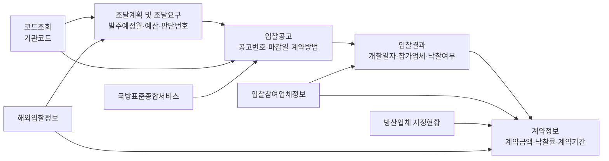

# DAPA 공공데이터 구조 및 위험관리 활용안

작성일: 2026-05-19

## 1. 목적

이 문서는 `DAPA 획득체계 통합관제 및 위험관리 예측 서비스`에서 활용할 핵심·보강·확장 공공데이터셋의 구조와 결합 방식을 정리한다. 목표는 방위사업 담당자가 국내외 조달, 계약, 구매 정보를 수작업으로 찾지 않고, 공개 API와 파일데이터를 구조화해 일정·비용·성능·경쟁성·공급망 위험을 조기에 확인하도록 하는 것이다.

## 2. 전체 데이터 연결 구조



## 3. 핵심 데이터셋

| 데이터셋 | 링크 | 데이터 구조 | 제공 가능한 정보 | 결합 대상 |
| --- | --- | --- | --- | --- |
| 방위사업청_군수품조달정보 조달계획 | <https://www.data.go.kr/data/15002017/openapi.do> | 발주예정월, 판단번호, 대표품목명, 집행유형, 계약방법, 입찰방법, 발주기관코드, 발주기관, 예산금액, 진행상태 | 조달요구 단계, 예산 기준선, 발주예정월, 국내/국외 구매 1차 분류, 계획 대비 공고 지연 탐지 | 입찰공고, 계약정보, 코드조회 |
| 방위사업청_군수품조달정보 입찰공고 | <https://www.data.go.kr/data/15002040/openapi.do> | 공고일자, 공고번호, 공고차수, G2B공고번호, 판단번호, 입찰명, 발주기관, 생산능력제출마감, 입찰참가등록마감, 입찰서제출마감, 개찰일시, 계약방법, 입찰형태, 기초예비가격 | 공고 단계, 마감기간, 공고 조건, 경쟁성 위험, 품목명세 기반 성능 위험 | 조달계획, 입찰결과, 국방표준종합서비스 |
| 방위사업청_군수품조달정보 입찰결과 | <https://www.data.go.kr/data/15002018/openapi.do> | 개찰일자, 그룹번호, 공고번호, 구매요청번호, 사업명, 품목수, 발주기관, 담당자, 국내/국외 경쟁입찰결과 상세, 참가업체, 복수예비가격 | 낙찰/유찰, 참가업체, 경쟁 부족, 개찰 후 계약 지연, 유사사업 결과 | 입찰공고, 계약정보, 입찰참여업체정보 |
| 방위사업청_군수품조달정보 계약정보 | <https://www.data.go.kr/data/15002019/openapi.do> | 계약일자, 계약번호, 계약명, 발주기관, 계약방법, 입찰방법, 계약업체명, 계약상태, 계약금액, 예정가격, 업무구분, 장기차수, 총부기금액, 계약보증금, 지체상금률, 계약시작일자, 계약종료일자, 낙찰률, 낙찰금액 | 계약 단계, 비용 편차, 계약기간, 낙찰률, 지체상금률, 장기계약, 계약상태 | 입찰결과, 조달계획, 방산업체 지정현황 |
| 방위사업청_군수품조달정보 코드조회 | <https://www.data.go.kr/data/15002020/openapi.do> | 코드, 코드명 | 발주기관코드 표준화, 기관명 불일치 제거, 기관별 통계 | 조달계획, 입찰공고, 입찰결과, 계약정보 |

## 4. 보강 데이터셋

| 데이터셋 | 링크 | 데이터 구조 | 제공 가능한 정보 | 결합 대상 |
| --- | --- | --- | --- | --- |
| 방위사업청_국내조달 조달계획 | <https://www.data.go.kr/data/15050919/fileData.do> | 집행예정월, 판단번호, 대표품명, 집행유형, 계약방법, 집행기관, 예산금액, 입찰방법, 진행상태, 담당자, 연락처 | 국내구매 연간 계획, API 이력 보강, 집행기관별 계획 분석 | 조달계획 API, 입찰공고 |
| 방위사업청_국외조달 조달계획 | <https://www.data.go.kr/data/15050925/fileData.do> | 집행예정월, 판단번호, 대표품명, 집행유형, 계약방법, 집행기관, 예산금액, 입찰방법, 진행상태 | 국외구매 계획, 해외 조달 일정, 예산 규모 | 해외입찰정보, 계약정보 |
| 방위사업청 국내조달 입찰참여업체정보 | <https://www.data.go.kr/data/15050921/fileData.do> | 순번, 업체명, 대표자 | 참여업체 수, 반복 참여, 신규 진입, 경쟁성 분석 | 입찰결과, 계약정보, 방산업체 지정현황 |
| 방위사업청_국내조달 경쟁 입찰결과 | <https://www.data.go.kr/data/15050917/fileData.do> | 입찰공고번호, 공고차수, 공고명, 계약체결형태, 계약체결방법, 낙찰자결정방법, 적격심사여부, 공고기관, 수요기관, 낙찰하한율, 예정가격, 기초금액, 추정가격, 개찰일자, 최종낙찰금액, 최종낙찰율, 최종낙찰업체 | 낙찰률, 낙찰자결정방식, 예정가격, 기초금액, 적격심사, 비용 위험 보강 | 입찰공고, 입찰결과 API, 계약정보 |
| 방위사업청_국내조달 계약정보 | <https://www.data.go.kr/data/15050920/fileData.do> | 계약번호, 계약차수, 계약명, 업무구분, 계약체결형태, 계약체결방법, 공동계약여부, 계약일자, 계약기간, 계약금액, 총계약금액, 예정가격, 수의계약사유, 계약기관, 수요기관, 대표업체, 국내업체여부, 사업자등록번호, 물가변동계약금액조정방법 | 국내계약 상세, 수의계약사유, 물가변동 조정, 대표업체, 총계약금액 | 계약정보 API, 경쟁 입찰결과, 입찰참여업체정보 |
| 방위사업청_방산업체 지정현황 | <https://www.data.go.kr/data/15081929/fileData.do> | 업체명, 분야, 지정일자, 비고 | 방산업체 여부, 분야별 공급망, 업체 집중도, 대체업체 후보 | 계약정보, 입찰참여업체정보 |

## 5. 확장 데이터셋

| 데이터셋 | 링크 | 데이터 구조 | 제공 가능한 정보 | 결합 대상 |
| --- | --- | --- | --- | --- |
| 방위사업청_해외입찰정보 | <https://www.data.go.kr/data/15020338/openapi.do> | 공고형태, 입찰기간 시작/종료, 입찰공고명 영문/원문/국문, 정보획득일자, 국가코드, 국가명, 권역코드, 권역명 | 해외 입찰공고, 국가·권역별 수요, 입찰기간, 국외구매·수출 기회 | 국외조달 조달계획, 방산업체 지정현황 |
| 방위사업청_국방표준종합서비스 | <https://www.data.go.kr/data/15064293/openapi.do> | 재고번호, 군급, 참조번호, 요청기관부서, 요청번호, 신청기간, 생산자부호, 국방장비부호, 품목식별번호, NIIN상태부호 | 품목 표준화, 규격·성능 리스크, 재고번호 기반 품목 식별 | 입찰공고 품목명세, 조달계획, 계약정보 |
| 방위사업청_방산물자 및 업체 지정현황 | <https://www.data.go.kr/data/15070264/fileData.do> | 방산물자, 업체, 지정정보 | 방산물자와 업체 매핑, 공급망 보강 | 방산업체 지정현황, 계약정보 |
| 산업통상부_방산업체 현황 | <https://www.data.go.kr/data/15083447/fileData.do> | 방산업체 현황 | 방산업체 정보 교차검증 | 방산업체 지정현황 |

## 6. 데이터 결합으로 제공할 수 있는 정보

| 제공 정보 | 필요한 데이터 조합 | 직원에게 주는 가치 |
| --- | --- | --- |
| 현재 사업 단계 | 조달계획 + 입찰공고 + 입찰결과 + 계약정보 | 현재 단계가 조달요구, 공고, 결과, 계약 중 어디인지 즉시 확인 |
| 일정 리스크 | 발주예정월 + 공고일자 + 개찰일자 + 계약일자 + 계약기간 | 계획 대비 지연, 공고 지연, 계약 지연, 납기 위험 확인 |
| 비용 리스크 | 예산금액 + 예정가격 + 계약금액 + 낙찰률 + 총계약금액 | 예산 대비 계약금액 괴리, 낙찰률 이상, 물가변동 가능성 확인 |
| 성능 리스크 | 품목명세서 + 국방표준 + 계약기간 + 성능개량 키워드 | 규격 불일치, 성능 요구 변경, 시험평가 지연 가능성 확인 |
| 경쟁성 리스크 | 계약방법 + 입찰형태 + 참가업체 + 낙찰업체 + 입찰참여업체정보 | 참여업체 부족, 유찰, 반복 낙찰, 제한경쟁 편중 확인 |
| 공급망 리스크 | 계약업체 + 방산업체 지정현황 + 분야 + 입찰참여업체정보 | 특정 업체 의존도, 분야별 대체업체 부족 확인 |
| 데이터 품질 | 공고번호 + 계약번호 + 판단번호 + 기관코드 + 업체명 + 품목명 | 데이터 누락, 중복, 명칭 불일치, 연결 실패 확인 |

## 7. 위험요소를 줄이는 사업관리 방식

## 7.1 조달계획 단계

데이터 조합:

- 조달계획
- 국내/국외 조달계획
- 코드조회

위험 저감:

- 발주예정월이 가까운데 공고가 없는 사업을 자동 경고
- 예산금액이 큰 사업을 우선관리 대상으로 자동 분류
- 계약방법이 제한경쟁·수의계약이면 사전 근거 확인 체크리스트 제시
- 국내구매/국외구매/연구개발/양산 1차 분류

## 7.2 입찰공고 단계

데이터 조합:

- 입찰공고
- 조달계획
- 국방표준종합서비스

위험 저감:

- 공고기간이 유사 공고보다 짧으면 경고
- 입찰참가등록마감, 입찰서 제출마감, 개찰일시를 캘린더화
- 품목명세서와 국방표준 매칭 실패 시 성능·규격 리스크 표시
- 제한경쟁 조건이 반복 유찰과 연결되는지 확인

## 7.3 입찰결과 단계

데이터 조합:

- 입찰결과
- 국내조달 경쟁 입찰결과
- 입찰참여업체정보

위험 저감:

- 유찰 발생 시 재공고 또는 수의계약 검토 필요 여부 알림
- 참가업체 수가 유사군 평균보다 낮으면 경쟁 부족 경고
- 낙찰하한율·예정가격·최종낙찰률 이상치 탐지
- 동일 업체 반복 낙찰 또는 단일 참여 위험 표시

## 7.4 계약정보 단계

데이터 조합:

- 계약정보
- 국내조달 계약정보
- 방산업체 지정현황

위험 저감:

- 계약금액이 예산금액·예정가격 대비 과도하게 벗어나면 경고
- 계약기간이 유사사업 대비 길면 일정 리스크 표시
- 수의계약사유, 물가변동 조정방법, 지체상금률 확인
- 계약업체가 특정 분야에 집중되어 있으면 공급망 리스크 표시

## 8. 획득유형별 리스크 적용

| 획득유형 | 핵심 위험 | 데이터 기반 점검 |
| --- | --- | --- |
| 국내구매 | 유찰, 경쟁 부족, 낙찰률 이상, 납기 지연 | 국내조달 조달계획, 입찰공고, 입찰결과, 계약정보, 참여업체 |
| 국외구매 | 해외 일정, 원문 조건, 환율·가격, 국가·권역 의존 | 국외조달 조달계획, 해외입찰정보, 계약정보 |
| 연구개발 | 성능 요구 변경, 개발 지연, 시험평가 지연 | 조달계획, 입찰공고, 계약정보, 국방표준, 개발/성능개량 키워드 |
| 양산 | 단가 상승, 생산능력, 품질, 납품 일정, 업체 집중 | 계약정보, 입찰참여업체정보, 방산업체 지정현황 |

## 9. LLM/SLM이 제공할 최종 화면 정보

```text
현재 단계: 입찰공고
획득유형: 국내구매
종합 위험: 높음 82점
주요 원인: 참여업체 감소, 공고-계약 기간 증가, 성능조건 경쟁 제한 가능성
근거 데이터: 조달계획 예산 38.5억, 유사 품목 참여업체 평균 4.2개, 최근 예상 2개
지금 챙길 일: 참가자격 조건, 공고 마감기간, 품목명세서·국방표준 매칭 확인
다음 준비사항: 입찰결과 단계에서 유찰·단일참여 여부 확인
법령·규정 근거: 국가계약법, 국가계약법 시행령, 방위사업법, 관련 행정규칙
```

## 10. 결론

핵심 4대 데이터셋인 조달계획, 입찰공고, 입찰결과, 계약정보만으로도 사업관리 타임라인과 일정·비용 리스크를 구성할 수 있다. 보강 데이터셋인 입찰참여업체정보, 국내조달 경쟁 입찰결과, 국내조달 계약정보, 방산업체 지정현황을 결합하면 경쟁성·공급망·수의계약·낙찰률 분석이 가능하다. 확장 데이터셋인 해외입찰정보와 국방표준종합서비스를 붙이면 국외구매와 성능·규격 리스크까지 확장할 수 있다.

