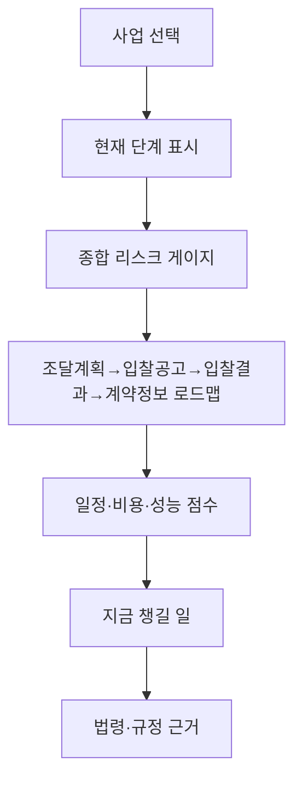
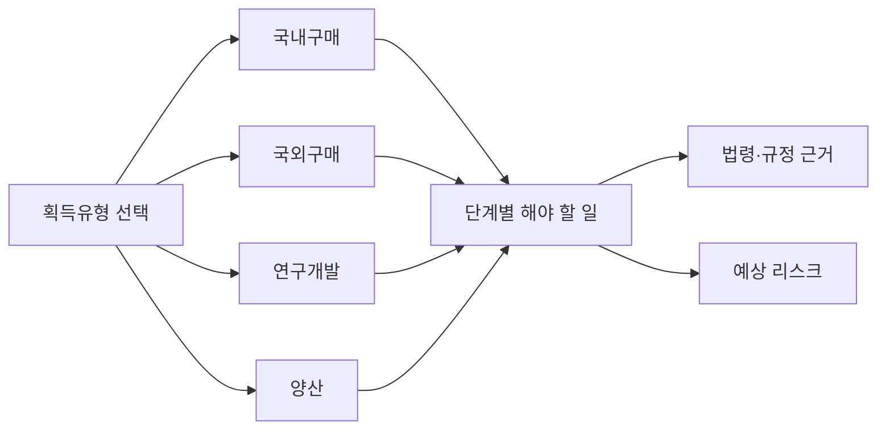
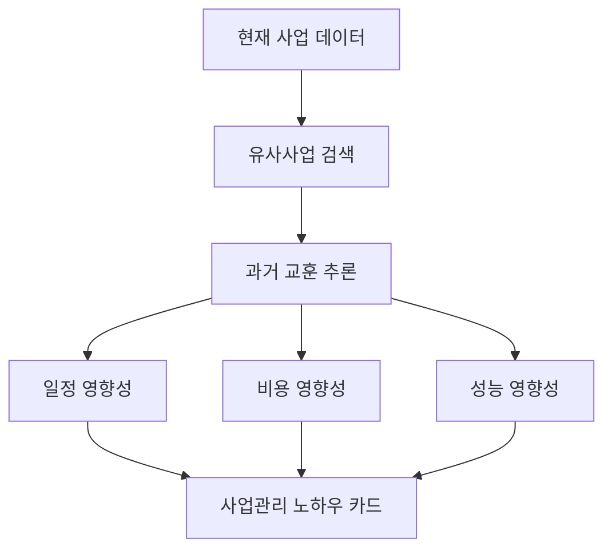

# DAPA 획득체계 통합관제 및 위험관리 예측 서비스 전략

## 1. 서비스 목적

`DAPA 획득체계 통합관제 및 위험관리 예측 서비스`는 방위사업청 공공데이터를 조합해 사업관리 담당자가 현재 사업 단계, 일정·비용·성능 리스크, 앞으로 챙겨야 할 사항, 참고해야 할 법령·규정을 직관적으로 확인하도록 지원하는 LLM 기반 의사결정 보조 서비스다.

이 서비스는 모든 사업위험을 예측한다고 주장하지 않는다. 대신 공공데이터로 예측 가능한 구간에서는 반드시 확인해야 할 항목을 자동으로 제시한다.

주요 고객:

- 방위사업청 신규 사업관리 담당자
- 경험이 부족한 통합사업관리팀 실무자
- 팀장 보고 전 사전 점검이 필요한 담당자
- 획득유형별 절차와 규정 확인이 필요한 직원

## 2. 핵심 메시지

> 현재 사업관리 단계는 무엇이고, 지금 무엇을 챙겨야 하며, 앞으로 어떤 위험을 준비해야 하는가?

서비스는 아래 4개 질문에 답해야 한다.

1. 현재 사업은 조달계획, 입찰공고, 입찰결과, 계약정보 중 어디에 있는가?
2. 일정, 비용, 성능 중 어느 부분의 위험이 높은가?
3. 지금 단계에서 담당자가 반드시 해야 할 일은 무엇인가?
4. 그 판단의 근거가 되는 데이터와 법령·규정은 무엇인가?

## 3. 사용할 공공데이터셋

## 3.1 핵심 데이터셋

| 데이터셋 | 포함 내용 | UI/UX에 송출할 내용 | 결합 대상 |
| --- | --- | --- | --- |
| 방위사업청_군수품조달정보 조달계획 | 발주예정월, 대표품목명, 판단번호, 집행유형, 계약방법, 입찰방법, 발주기관, 예산금액, 요구년도, 진행상태 | 조달요구 단계, 발주예정월, 예산 기준, 현재 진행상태, 획득유형 1차 분류 | 입찰공고, 계약정보, 코드조회 |
| 방위사업청_군수품조달정보 입찰공고 | 공고일자, 공고번호, 입찰명, 발주기관, 입찰마감, 개찰일시, 계약방법, 입찰형태, 업무구분, 품목명세서 | 입찰공고 단계, 공고 기간, 마감 임박 여부, 공고 품질 위험 | 조달계획, 입찰결과, 국방표준종합서비스 |
| 방위사업청_군수품조달정보 입찰결과 | 낙찰 여부, 개찰일시, 계약방법, 입찰방법, 업무구분, 참가업체, 복수예비가격 | 유찰 여부, 경쟁 부족, 참여업체 수, 낙찰 이상징후 | 입찰공고, 계약정보, 입찰참여업체정보 |
| 방위사업청_군수품조달정보 계약정보 | 계약명, 계약업체, 계약방법, 입찰방법, 계약금액, 예정가격, 낙찰률, 계약기간, 진행상태 | 계약 단계, 비용 편차, 계약기간, 낙찰률, 계약 이행 위험 | 입찰결과, 방산업체 지정현황 |
| 방위사업청_군수품조달정보 코드조회 | 발주기관명, 발주기관코드 | 기관명 표준화, 기관별 필터 | 전체 데이터셋 |

## 3.2 보강 데이터셋

| 데이터셋 | 포함 내용 | UI/UX에 송출할 내용 | 결합 대상 |
| --- | --- | --- | --- |
| 국내조달 조달계획 | 집행예정월, 판단번호, 대표품명, 집행유형, 계약방법, 예산금액, 입찰방법, 진행상태 | 국내구매 단계 기준, 연도별 조달계획 | 조달계획 API, 입찰공고 |
| 국외조달 조달계획 | 발주기관, 조달 일정, 조달 방식, 예산 규모 | 국외구매 단계 기준, 해외 조달 일정 | 해외입찰정보, 계약정보 |
| 국내조달 입찰참여업체정보 | 업체명, 대표자명 등 | 참여업체 수, 반복 참여, 신규 진입 여부 | 입찰결과, 계약정보 |
| 국내조달 경쟁 입찰결과 | 공고번호, 공고명, 계약체결방법, 낙찰자결정방법, 예정가격 | 낙찰방식, 적격심사, 경쟁구조 보강 | 입찰결과 API, 계약정보 |
| 국내조달 계약정보 | 계약번호, 계약차수, 계약명, 계약금액, 계약일자 | 계약정보 보강, 국내계약 분석 | 계약정보 API |
| 방산업체 지정현황 | 업체명, 지정일자, 방산업체 분야 | 방산업체 여부, 분야별 공급망, 업체 집중도 | 계약업체, 입찰참여업체 |
| 해외입찰정보 | 공고명, 국가·권역, 입찰기간, 공고형태, 발주기관, 품목명, 수량, 금액, 원문 URL | 국외구매·방산수출 기회, 해외 수요 트렌드 | 국외조달 조달계획, 방산업체 지정현황 |
| 국방표준종합서비스 | 국방표준, 규격목록, 재고번호, 군급, 참조번호, 요청기관 | 성능·규격 리스크, 품목 표준화 | 입찰공고 품목명세서, 계약정보 |

## 4. 데이터 조합 방식

## 4.1 기본 연결 흐름


## 4.2 결합 키

| 우선순위 | 결합 키 | 사용 목적 |
| --- | --- | --- |
| 1 | 공고번호, 공고차수, G2B공고번호차수 | 입찰공고와 입찰결과 연결 |
| 2 | 계약번호, 계약차수 | 입찰결과와 계약정보 연결 |
| 3 | 판단번호, 요구년도 | 조달계획과 공고 후보 연결 |
| 4 | 발주기관코드, 발주기관명 | 기관 단위 표준화 |
| 5 | 업체명, 계약업체명 | 업체 집중도, 반복 낙찰 분석 |
| 6 | 대표품목명, 입찰명, 계약명 | 유사사업 검색 |
| 7 | 날짜 범위 | 발주예정월 → 공고일자 → 개찰일자 → 계약일자 타임라인 |

정확 키 연결이 실패하면 텍스트 유사도와 날짜 범위로 후보 연결하고, `연결 신뢰도`를 화면에 표시한다.

## 5. 획득유형별 서비스 로직

## 5.1 국내구매

### 데이터 조합

- 국내조달 조달계획
- 군수품조달정보 조달계획
- 입찰공고
- 입찰결과
- 계약정보
- 입찰참여업체정보
- 방산업체 지정현황

### 예측 가능한 위험

| 관리 영역 | 예측 지표 | 담당자에게 제시할 내용 |
| --- | --- | --- |
| 일정 | 발주예정월 대비 공고 지연, 개찰일자 대비 계약 지연 | 공고 전 지연 가능성, 계약 체결 예상 지연 |
| 비용 | 예산금액, 예정가격, 계약금액, 낙찰률 편차 | 예산 대비 비용 괴리, 유사 계약 평균 비교 |
| 성능 | 품목명세서, 국방표준, 계약기간 증가 | 성능 조건이 경쟁을 제한하는지 확인 |
| 경쟁 | 참가업체 수, 반복 낙찰, 유찰 이력 | 경쟁 부족 가능성, 대체업체 후보 |

### 화면에서 제시할 사업관리 노하우

- 참가자격이 과도하게 좁은지 확인
- 유사 품목의 유찰 이력 확인
- 예정가격 산정 근거 확인
- 성능 조건과 계약방법이 경쟁을 제한하지 않는지 확인
- 방산업체 지정현황에서 대체업체 후보 확인

## 5.2 국외구매

### 데이터 조합

- 국외조달 조달계획
- 군수품조달정보 조달계획
- 입찰공고
- 계약정보
- 해외입찰정보
- 방산업체 지정현황

### 예측 가능한 위험

| 관리 영역 | 예측 지표 | 담당자에게 제시할 내용 |
| --- | --- | --- |
| 일정 | 국외 입찰기간, 계약기간, 납기 장기화 | 해외 조달 일정 지연 가능성 |
| 비용 | 총금액, 화폐단위, 계약금액, 예산규모 | 환율·국외 가격 변동 감시 필요 |
| 성능 | 품목명, 품목구분, 원문 조건 | 요구성능·규격 번역 및 조건 누락 확인 |
| 공급망 | 국가·권역, 발주기관, 해외 공급자 정보 | 특정 국가·권역 의존도 |

### 화면에서 제시할 사업관리 노하우

- 원문 공고의 품목·수량·금액 조건 확인
- 국외 조달 일정과 국내 소요 일정 차이 확인
- 해외입찰정보와 국내 방산업체 역량 매칭
- 납기·검수·운송 리스크 체크
- 방산수출입 관련 규정 검토

## 5.3 연구개발

### 데이터 조합

- 조달계획
- 입찰공고
- 계약정보
- 국방표준종합서비스
- 유사 연구개발·성능개량 계약

### 예측 가능한 위험

| 관리 영역 | 예측 지표 | 담당자에게 제시할 내용 |
| --- | --- | --- |
| 일정 | 계약기간, 단계 전환 지연, 유사 개발사업 기간 | 개발 일정 지연 가능성 |
| 비용 | 계약금액, 예정가격, 유사 개발사업 비용 | 개발비 증가 가능성 |
| 성능 | 품목명세서, 규격, 성능개량 키워드 | 성능 요구 변경 가능성 |
| 시험평가 | 계약기간 증가, 검수·시험 관련 키워드 | 시험평가 일정 사전 확인 |

### 화면에서 제시할 사업관리 노하우

- 탐색개발·체계개발·시제·성능개량 키워드 확인
- 성능 요구사항 변경 가능성 확인
- 시험평가 일정과 계약기간 영향 확인
- 개발성과물의 규격화 가능성 확인
- 과거 유사 개발사업의 지연 원인 확인

## 5.4 양산

### 데이터 조합

- 조달계획
- 입찰결과
- 계약정보
- 국내조달 계약정보
- 입찰참여업체정보
- 방산업체 지정현황

### 예측 가능한 위험

| 관리 영역 | 예측 지표 | 담당자에게 제시할 내용 |
| --- | --- | --- |
| 일정 | 반복 계약의 납품기간 변화 | 생산·납품 지연 가능성 |
| 비용 | 초도양산 대비 후속양산 단가, 계약금액 추세 | 단가 상승 또는 비용 안정성 |
| 성능 | 품질·검수 관련 계약기간 증가 | 품질 이슈 가능성 |
| 공급망 | 업체 집중도, 반복 낙찰, 분야별 업체 수 | 특정 업체 의존도 |

### 화면에서 제시할 사업관리 노하우

- 초도양산 대비 후속양산 단가 변화 확인
- 납품 일정이 반복적으로 지연되는지 확인
- 동일 업체 집중도가 과도한지 확인
- 방산업체 분야별 대체 가능성 확인
- 품질관리 규정과 검수 기준 확인

## 6. 법령정보 MCP 연계 설계

## 6.1 법령AI 확인 결과

법령AI MCP를 통해 다음 법령 체계를 확인했다.

| 법령 | 확인 내용 | 서비스 활용 |
| --- | --- | --- |
| 방위사업법 | 법령ID `010107`, 시행령·시행규칙 체계 확인 | 방위사업, 무기체계, 방위사업계약, 주요 정책관리 근거 |
| 방위사업법 시행령 | 무기체계 분류, 방위사업계약 범위, 장기계약 정의 등 확인 | 획득유형·무기체계 분류 설명 |
| 국가를 당사자로 하는 계약에 관한 법률 | 계약방법, 국제입찰, 청렴계약, 계약사무 체계 확인 | 입찰·계약 단계 체크포인트 |
| 국가계약법 시행령 | 입찰참가자격 사전심사, 제한경쟁, 수의계약, 재공고입찰 등 확인 | 입찰공고·입찰결과 단계 규정 근거 |

방위사업법 체계 조회에서 관련 행정규칙으로 다음이 확인되었다.

- 국방전력발전업무훈령
- 방산 수출입 심사업무 훈령
- 방위사업 품질관리 규정
- 방위산업물자 및 방위산업체 지정 규정
- 획득단계 수명주기관리규정
- 과학적사업관리 수행지침

단, 일부 행정규칙은 법령명 직접 검색에서 실패했다. 따라서 실제 서비스에서는 법령AI로 법률·시행령·시행규칙을 우선 조회하고, 행정규칙은 별도 행정규칙 수집 모듈 또는 내부 지식베이스로 보강한다.

## 6.2 단계별 법령·규정 제시

| 단계 | 클릭 시 LLM이 제시할 법령·규정 | 담당자 체크포인트 |
| --- | --- | --- |
| 조달계획 및 조달요구 | 방위사업법, 방위사업법 시행령, 국방전력발전업무훈령, 획득단계 수명주기관리규정 | 무기체계 분류, 획득유형, 예산 기준, 장기계약 여부 |
| 입찰공고 | 국가계약법, 국가계약법 시행령, 국방전자조달시스템 관리규정 | 계약방법, 제한경쟁 사유, 입찰참가자격, 공고기간 |
| 입찰결과 | 국가계약법 시행령, 계약업무처리훈령, 정부 입찰·계약 집행기준 | 유찰, 재공고, 수의계약 전환 가능성, 참가업체 수 |
| 계약정보 | 국가계약법, 국가계약법 시행령, 물품구매계약 일반조건, 예정가격 작성기준 | 계약금액, 예정가격, 낙찰률, 계약기간, 청렴계약 |
| 연구개발 | 방위사업법, 획득단계 수명주기관리규정, 과학적사업관리 수행지침 | 개발단계, 성능 요구 변경, 시험평가 일정 |
| 양산 | 방위사업 품질관리 규정, 방산업체 지정 규정, 계약정보 | 품질관리, 납품 일정, 생산능력, 업체 집중도 |
| 국외구매 | 국가계약법 제4조 관련 국제입찰, 외자입찰유의서, 방산 수출입 심사업무 훈령 | 원문 조건, 국가·권역, 납기, 통제 대상 여부 |

## 7. UI/UX 서비스 3안

## 안 1. 획득체계 통합관제 대시보드

### 개념

사업을 선택하면 현재 단계와 종합 위험도를 가장 먼저 보여준다.



### 화면 구성

- 상단: 사업명, 획득유형, 현재 단계, 종합 리스크
- 중앙: 획득 단계 로드맵
- 좌측: 일정·비용·성능 점수 카드
- 우측: AI 브리핑, 지금 챙길 일, 법령 근거
- 하단: 데이터 연결 신뢰도, 데이터 품질 점수

### 장점

- 가장 직관적이다.
- 신규 직원이 현재 상태를 빠르게 이해한다.
- 경진대회 데모에 적합하다.

### 단점

- 세부 규정 학습 기능은 별도 탭이 필요하다.

## 안 2. 획득유형별 단계 클릭 서비스

### 개념

국내구매, 국외구매, 연구개발, 양산을 먼저 선택하고 해당 유형의 단계별 체크리스트를 보여준다.



### 화면 구성

- 상단: 획득유형 선택 탭
- 중앙: 유형별 단계 로드맵
- 우측: 클릭한 단계의 규정·체크포인트
- 하단: 유사사업 교훈과 데이터 근거

### 장점

- 국내구매·국외구매·연구개발·양산 절차 차이를 반영하기 좋다.
- 직원 교육용으로 강하다.
- 단계별 누락 방지에 적합하다.

### 단점

- 통합 관제 화면보다 초기 정보량이 많다.

## 안 3. 사업관리 노하우 맵

### 개념

사업관리 경험이 부족한 직원에게 일정·비용·성능 관점의 “노하우”를 카드로 제시한다.



### 화면 구성

- 상단: 종합 리스크
- 중앙: 일정·비용·성능 영향성 매트릭스
- 좌측: 유사사업 교훈
- 우측: 이번 사업에서 챙길 일
- 하단: 관련 법령·규정, 데이터 출처

### 장점

- 경험 기반 노하우를 데이터로 전달한다.
- 팀장 보고, 월간 점검회의에 적합하다.

### 단점

- 단계별 업무 진행 화면으로는 안 1, 안 2보다 약하다.

## 8. 최종 추천 서비스 구조

1차 도입안은 `안 1. 획득체계 통합관제 대시보드`를 기본 화면으로 한다.

2차 고도화에서 다음 탭을 추가한다.

- `획득유형별 단계`: 안 2
- `사업관리 노하우`: 안 3
- `법령·규정 근거`: 법령AI MCP 연동
- `데이터 품질`: 데이터셋 연결·누락·표준화 점검

## 9. LLM이 화면에 출력해야 하는 문장 구조

LLM 출력은 긴 설명이 아니라 아래 구조로 고정한다.

```text
현재 단계: 입찰공고
위험 수준: 주의 72점
가장 큰 위험: 경쟁 부족
근거 데이터: 유사 품목 평균 참여업체 4.2개, 현재 예상 2개
지금 챙길 일: 참가자격 조건과 공고 마감기간 재검토
다음 준비사항: 입찰결과 단계에서 유찰·단일참여 여부 확인
참고 법령·규정: 국가계약법 제7조, 국가계약법 시행령 제한경쟁·수의계약 관련 규정
```

## 10. 경진대회 제출용 핵심 설명

이 서비스는 방위사업청의 조달계획, 입찰공고, 입찰결과, 계약정보, 업체정보, 방산업체 지정현황, 국방표준 데이터를 연결해 획득사업의 현재 단계와 위험요인을 시각적으로 제시한다. 담당자는 화면에서 현재 단계, 일정·비용·성능 위험, 지금 챙겨야 할 일, 다음 준비사항, 관련 법령·규정 근거를 함께 확인할 수 있다.

경험이 부족한 직원도 사업관리 노하우를 데이터 기반으로 확인할 수 있으며, 예측 가능한 구간에서는 반드시 점검해야 할 사항을 놓치지 않도록 지원한다.

