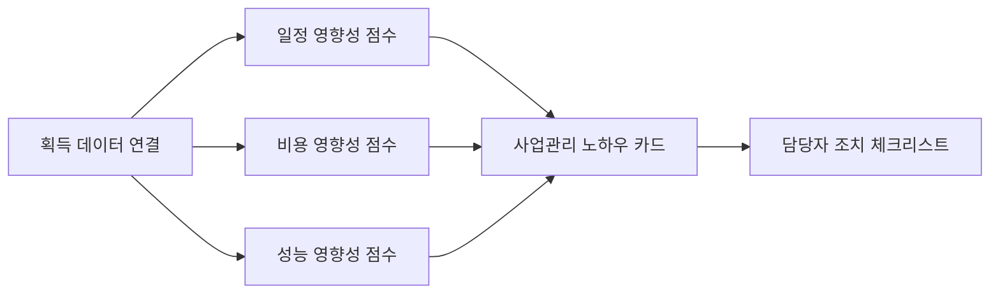

# 추가 아이디어 구현 검토: Lessons Learned AI & Data Quality Monitor

## 1. DAPA Lessons Learned AI

과거 획득사업 교훈·유사사례 검색 AI

### 구현 가능한 공공데이터

| 데이터 | 제공 형태 | 활용 방식 |
| --- | --- | --- |
| 방위사업청_군수품조달정보 조달계획 | OpenAPI | 발주예정월, 대표품목명, 예산금액, 계약방법, 진행상태를 기준으로 사업 출발점 구성 |
| 방위사업청_군수품조달정보 입찰공고 | OpenAPI | 공고번호, 입찰명, 공고일자, 마감일시, 계약방법, 업무구분으로 공고 조건 분석 |
| 방위사업청_군수품조달정보 입찰결과 | OpenAPI | 낙찰 여부, 참가업체, 개찰일시, 예정가격으로 유찰·경쟁성·낙찰 패턴 분석 |
| 방위사업청_군수품조달정보 계약정보 | OpenAPI | 계약금액, 예정가격, 계약기간, 계약상태로 비용·일정 결과 분석 |
| 방위사업청_국내조달 경쟁 입찰결과 | CSV/API | 입찰공고번호, 공고차수, 낙찰자결정방법, 적격심사여부, 예정가격 등 보강 |
| 방위사업청 국내조달 입찰참여업체정보 | CSV/API | 업체명, 대표자명으로 참여업체 반복성·경쟁 구조 분석 |
| 방위사업청_방산업체 지정현황 | CSV/API | 업체명, 분야, 지정일자로 방산업체 분야별 유사성 분석 |
| 방위사업청_군수품조달정보 코드조회 | OpenAPI | 발주기관 코드 등 코드값 정규화 |

### 구현 방식

내부 교훈 문서 없이도 1차 MVP는 가능하다. 다만 명칭을 정확히 잡아야 한다.

- 내부 문서 없음: `과거 조달 패턴 기반 교훈 추론 AI`
- 내부 문서 연계 가능: `과거 획득사업 교훈 검색 AI`

1차 MVP는 공공데이터만으로 다음 교훈 카드를 자동 생성한다.

| 교훈 유형 | 생성 기준 |
| --- | --- |
| 유찰 교훈 | 동일·유사 품목에서 유찰 또는 경쟁 부족이 반복된 경우 |
| 일정 교훈 | 발주예정월 대비 공고일자, 공고일자 대비 계약일자가 유사군보다 긴 경우 |
| 비용 교훈 | 예산금액, 예정가격, 계약금액, 낙찰률이 유사군과 크게 차이 나는 경우 |
| 경쟁성 교훈 | 참여업체 수가 적거나 동일 업체 반복 낙찰이 나타난 경우 |
| 성능 관리 교훈 | 품목명세서, 계약기간, 업무구분상 성능·검수 리스크가 큰 경우 |

### 화면 표현

텍스트 목록이 아니라 `사업관리 노하우 카드`로 보여준다.

- 일정 관리 영향성: 0~100점
- 비용 관리 영향성: 0~100점
- 성능 관리 영향성: 0~100점
- 주요 원인: 막대그래프
- 담당자 행동: 체크리스트
- 유사사업: 비교 카드

## 2. Defense Procurement Data Quality Monitor

공고번호, 계약번호, 품목명, 업체명 불일치와 누락을 자동 탐지하는 데이터 품질 점검 서비스

### 구현 가능성

구현 가능성이 매우 높다. 이유는 데이터 품질 점검은 예측 모델보다 먼저 만들 수 있고, 공개데이터의 정형 필드만으로도 작동하기 때문이다.

### 구현 가능한 공공데이터

| 점검 대상 | 활용 데이터 | 점검 내용 |
| --- | --- | --- |
| 조달계획 필수값 | 조달계획 OpenAPI, 국내조달 조달계획 CSV/API | 판단번호, 대표품목명, 발주예정월, 계약방법, 예산금액 누락 |
| 입찰공고 식별자 | 입찰공고 OpenAPI, 국내조달 경쟁 입찰공고 CSV/API | 공고번호, 공고차수, G2B공고번호차수 형식 오류·중복 |
| 입찰결과 연결성 | 입찰결과 OpenAPI, 국내조달 경쟁 입찰결과 CSV/API | 공고번호 기준 공고-결과 연결 실패 |
| 계약정보 연결성 | 계약정보 OpenAPI, 국내조달 계약정보 CSV/API | 계약번호, 계약명, 계약금액, 예정가격, 계약기간 누락 |
| 업체명 표준화 | 입찰참여업체정보, 계약정보, 방산업체 지정현황 | 업체명 표기 차이, 괄호·공백·법인 접미어 차이 |
| 코드 정합성 | 군수품조달정보 코드조회 | 발주기관코드와 발주기관명 불일치 |

### 품질 점수 산식 예시

```text
데이터 품질 종합점수 =
  완전성 30%
+ 키 일관성 25%
+ 명칭 표준화 20%
+ 단계 연결률 20%
+ 최신성 5%
```

| 품질 항목 | 점수화 방법 |
| --- | --- |
| 완전성 | 필수 필드 중 null/공란 비율 |
| 키 일관성 | 공고번호, 계약번호, 판단번호 형식·중복·참조 가능성 |
| 명칭 표준화 | 동일 업체·품목으로 추정되는 표기 변형 개수 |
| 단계 연결률 | 조달계획→공고→결과→계약 연결 성공률 |
| 최신성 | 수정일, 갱신 주기, 수집 기준일 차이 |

### 실제 탐지 규칙

| 규칙 | 예시 |
| --- | --- |
| 필수값 누락 | 계약금액이 없거나 계약기간이 비어 있음 |
| 키 중복 | 같은 공고번호·공고차수가 여러 행에 중복됨 |
| 참조 실패 | 입찰결과에는 공고번호가 있는데 입찰공고 데이터에는 없음 |
| 명칭 불일치 | `한화에어로스페이스`, `한화에어로스페이스(주)`, `한화 에어로스페이스` |
| 날짜 역전 | 계약일자가 개찰일자보다 빠름 |
| 금액 이상 | 계약금액이 예정가격보다 비정상적으로 크거나 0원 |
| 코드 불일치 | 발주기관코드와 기관명이 코드조회 결과와 맞지 않음 |

## 3. 사업관리 노하우 표현 방식

### 목표

담당자가 긴 설명을 읽기 전에 사업 영향성을 먼저 보게 한다.



### 화면 구성

| 영역 | 시각화 |
| --- | --- |
| 종합 리스크 | 원형 게이지 |
| 일정·비용·성능 | 3개 영향성 카드 |
| 리스크 원인 | 가로 막대그래프 |
| 데이터 품질 | 4개 원형 점수 링 |
| 획득 흐름 | 조달계획→입찰공고→입찰결과→계약정보 로드맵 |
| 조치 필요 항목 | 체크리스트 |

### 점수 의미

| 점수 | 의미 |
| --- | --- |
| 0~39 | 영향 낮음 |
| 40~54 | 관찰 필요 |
| 55~74 | 주의 필요 |
| 75~100 | 즉시 관리 필요 |

## 4. 프로토타입 반영

프로토타입에 다음 항목을 추가했다.

- `성능 관리` 점수 카드
- `사업관리 노하우: 일정·비용·성능 영향성` 패널
- `데이터 품질 점검` 패널
- 완전성, 키 일관성, 명칭 표준화, 연결률 점수 링

파일:

- `dapa_control_tower_demo.html`
- `dapa_control_tower_style.css`
- `dapa_control_tower_app.js`

