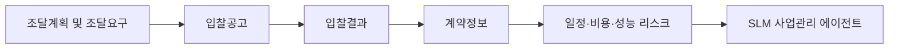

# SLM 에이전트 기반 UI/UX 3안

## 개요

3가지 안은 모두 같은 공공데이터를 사용하지만, 직원에게 정보를 보여주는 방식이 다르다.

공통 데이터 흐름:



공통 SLM 역할:

- 현재 사업관리 단계 판별
- 다음에 챙겨야 할 일 제시
- 일정·비용·성능 리스크 요약
- 유사사업 기반 노하우 제시
- 법령·규정 근거 추천
- 데이터 연결 신뢰도와 품질 점검

---

## 안 1. 획득체계 통합관제 대시보드


### 컨셉

사업을 선택하면 현재 사업의 종합 리스크, 현재 단계, 조달요구→입찰공고→입찰결과→계약정보 흐름을 한 화면에 보여준다.

### 직원이 활용하는 방식

1. 사업명을 검색하거나 선택한다.
2. 화면 상단에서 현재 단계와 종합 위험 점수를 확인한다.
3. 중앙 로드맵에서 조달계획, 입찰공고, 입찰결과, 계약정보 중 어느 단계가 위험한지 본다.
4. 우측 `지금 챙길 일`에서 담당자가 즉시 해야 할 업무를 확인한다.
5. SLM 에이전트가 관련 법령·규정과 데이터 근거를 연결해 설명한다.

### 데이터 해석 방식

| 데이터 | 화면 해석 |
| --- | --- |
| 조달계획 | 발주예정월, 예산금액, 진행상태로 일정 기준선 생성 |
| 입찰공고 | 공고기간, 계약방법, 입찰형태로 경쟁성 위험 판단 |
| 입찰결과 | 낙찰 여부, 참가업체 수로 유찰·경쟁 부족 판단 |
| 계약정보 | 계약금액, 낙찰률, 계약기간으로 비용·일정 위험 판단 |
| 입찰참여업체정보 | 참여업체 감소, 반복 참여, 업체 집중도 판단 |

### 장점

- 가장 직관적이다.
- 경진대회 데모와 실제 부서장 보고 화면에 적합하다.
- 경험이 부족한 직원도 현재 위험 수준을 빠르게 이해한다.

### 적합한 사용 장면

- 일일/주간 사업관리 점검
- 신규 담당자 업무 시작 화면
- 고위험 사업 선별
- 팀장 보고 전 사전 점검

---

## 안 2. 획득유형별 단계 클릭 서비스


### 컨셉

국내구매, 국외구매, 연구개발, 양산 중 획득유형을 먼저 선택하고, 해당 유형의 단계별 체크리스트와 법령·규정을 보여준다.

### 직원이 활용하는 방식

1. 사업의 획득유형을 선택한다.
2. 현재 단계 카드를 클릭한다.
3. SLM 에이전트가 해당 단계에서 해야 할 일을 체크리스트로 제시한다.
4. 법령·규정 근거와 데이터 근거를 함께 확인한다.
5. 다음 단계에서 미리 준비할 사항을 확인한다.

### 데이터 해석 방식

| 획득유형 | 주요 데이터 조합 | 해석 |
| --- | --- | --- |
| 국내구매 | 국내조달 조달계획 + 입찰공고 + 입찰결과 + 계약정보 | 유찰, 경쟁 부족, 낙찰률, 계약기간 위험 |
| 국외구매 | 국외조달 조달계획 + 해외입찰정보 + 계약정보 | 해외 일정, 원문 조건, 납기, 국가·권역 리스크 |
| 연구개발 | 조달계획 + 입찰공고 + 계약정보 + 국방표준종합서비스 | 성능 요구 변경, 시험평가 일정, 개발기간 리스크 |
| 양산 | 계약정보 + 입찰참여업체정보 + 방산업체 지정현황 | 단가 추세, 납품 일정, 업체 집중도, 품질 리스크 |

### 장점

- 국내구매·국외구매·연구개발·양산별 절차 차이를 반영하기 좋다.
- 단계별 누락 방지에 강하다.
- 법령·규정 학습형 서비스로 확장하기 좋다.

### 적합한 사용 장면

- 신규 직원 교육
- 획득유형별 업무 체크
- 특정 단계 법령·규정 확인
- 업무 누락 방지

---

## 안 3. 사업관리 노하우 맵


### 컨셉

과거 유사사업 패턴을 기반으로 일정·비용·성능 관점의 사업관리 노하우를 카드로 제시한다.

### 직원이 활용하는 방식

1. 현재 사업 데이터를 불러온다.
2. SLM 에이전트가 유사사업을 찾는다.
3. 일정, 비용, 성능 영향성을 각각 점수화한다.
4. 각 영향성 카드에서 담당자가 챙겨야 할 노하우를 확인한다.
5. 유사사업의 반복 위험을 이번 사업 체크리스트로 전환한다.

### 데이터 해석 방식

| 관리 영역 | 데이터 조합 | 해석 |
| --- | --- | --- |
| 일정 | 발주예정월, 공고일자, 개찰일자, 계약일자, 계약기간 | 단계 전환 지연, 계약 지연, 납품 지연 가능성 |
| 비용 | 예산금액, 예정가격, 계약금액, 낙찰률 | 예산 대비 비용 괴리, 단가 상승, 낙찰률 이상 |
| 성능 | 품목명세서, 국방표준, 계약기간, 성능개량 키워드 | 성능 요구 변경, 규격 불일치, 시험평가 지연 |
| 경쟁성 | 참가업체 수, 입찰참여업체정보, 방산업체 지정현황 | 업체 집중도, 대체업체 부족, 반복 낙찰 |

### 장점

- 경험 많은 직원의 노하우를 데이터 기반 카드로 전달한다.
- 신규 직원이 “왜 이 사업이 위험한지” 이해하기 쉽다.
- 월간 점검회의와 사업 착수 검토에 적합하다.

### 적합한 사용 장면

- 사업 착수 단계 리스크 검토
- 경험 부족 직원의 업무 가이드
- 과거 유사사업 교훈 확인
- 일정·비용·성능 영향성 보고

---

## 최종 추천

1차 도입은 `안 1. 획득체계 통합관제 대시보드`를 추천한다.

이유:

- 가장 직관적이다.
- 한 화면에서 현재 단계와 위험 수준을 이해할 수 있다.
- 공공데이터 연결 구조를 설명하기 쉽다.
- 경진대회 발표와 실제 방위사업청 도입 제안 모두에 적합하다.

2차 고도화는 다음 구조가 적합하다.

```text
홈: 안 1 통합관제 대시보드
탭 1: 안 2 획득유형별 단계 클릭 서비스
탭 2: 안 3 사업관리 노하우 맵
탭 3: 법령·규정 근거
탭 4: 데이터 품질 점검
```

