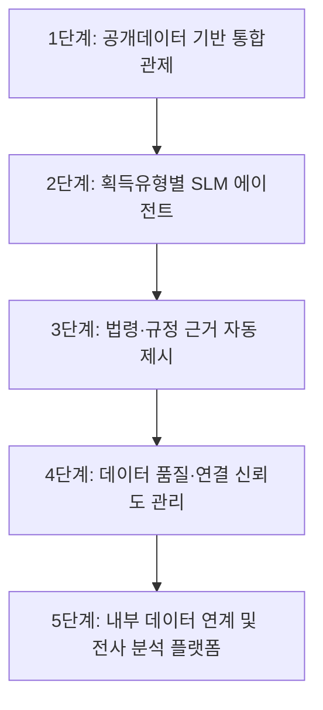

# World Market: 방위사업 자동화·사업관리 시스템 사례

작성일: 2026-05-19

## 1. 조사 목적

`DAPA 획득체계 통합관제 서비스`가 방위사업청 도입사업으로 설득력을 가지려면, 해외 주요 국방기관이 어떤 방식으로 조달·획득·계약·데이터 분석을 자동화하고 있는지 비교할 필요가 있다.

해외 사례의 공통 방향은 다음과 같다.

- 조달 공고와 계약 기회를 디지털 포털로 통합
- 공급업체 등록, 입찰, 계약, 지불을 전자화
- 데이터 분석 플랫폼으로 의사결정 지원
- 획득 절차를 유형별로 나누어 관리
- 공급망, 품질, 일정, 비용 정보를 단계별로 추적

## 2. 해외 주요 사례 요약

| 국가/기관 | 시스템/제도 | 핵심 기능 | DAPA 서비스에 주는 시사점 |
| --- | --- | --- | --- |
| 미국 DoD | Adaptive Acquisition Framework | 획득 경로를 6개 pathway로 분리해 사업 특성별 획득전략을 선택 | 국내구매·국외구매·연구개발·양산별로 리스크 산식과 체크리스트를 달리해야 함 |
| 미국 DoD/CDAO | Advana | 국방부 전사 데이터와 분석도구를 통합해 의사결정 지원 | 단순 데이터 저장이 아니라 `데이터→분석→의사결정` 흐름이 중요 |
| 영국 MOD | Defence Sourcing Portal, CP&F | 계약 기회 공고, 공급업체 전자입찰, 구매·계약·지불 전자화 | 입찰공고와 계약정보를 한 화면에서 연결해야 함 |
| NATO NSPA | eProcurement, CATOC, NLSE, GPSS | NATO 조달기회, 역량 카탈로그, 물류·재고·전략소싱 지원 | 다국가 조달·공급망·물류 정보를 통합 관점으로 봐야 함 |
| EU | TED, eProcurement | 유럽 공공조달 공고 통합 검색 및 전자조달 | 공고 표준화와 검색성이 중요 |
| 호주 Defence/CASG | Defence procurement portals, AusTender | 방위 조달기회와 계약공고, 공급업체 정보 제공 | 국가 조달포털과 국방전용 조달정보의 연계 필요 |
| 캐나다 Defence Procurement | Defence procurement strategy, CanadaBuys | 국방 조달과 일반 정부조달 플랫폼 연계 | 방산 조달도 범정부 조달체계와 연결됨 |
| 프랑스 DGA | Defence acquisition authority, procurement portals | 무기체계 획득기관 중심의 개발·조달 관리 | 획득전문기관의 데이터 기반 사업관리 체계 필요 |

## 3. 미국 DoD: Adaptive Acquisition Framework

공식 출처:

- DAU Adaptive Acquisition Framework: <https://www.dau.edu/adaptive-acquisition-framework-0>
- DoD CIO Digital Capability Acquisition Guidebook: <https://dodcio.defense.gov/Portals/0/Documents/Library/RequirementsAcquisitionDigitalCapabilitiesGuidebook.pdf>

### 핵심 내용

미국 DoD는 획득사업을 하나의 절차로 보지 않고 사업 특성에 따라 여러 획득 경로로 구분한다. DAU는 Adaptive Acquisition Framework를 “DoD 획득 인력이 더 빠르게 더 나은 솔루션을 제공하도록 전략을 조정할 수 있게 하는 획득 경로의 집합”으로 설명한다.

Digital Capability Acquisition Guidebook은 Adaptive Acquisition Framework 아래에 6개 획득 경로가 있고, 일반적으로 요구 검증, 획득계획, 승인, 획득관리 활동을 포함한다고 설명한다.

### 자동화 관점

- 사업 유형별로 절차와 산출물이 다름
- 하나의 획득 로드맵보다 `pathway 기반 맞춤 관리`가 중요
- 디지털 역량 획득은 요구 검증, 계획, 승인, 관리 단계별 체크가 필요

### DAPA 적용 시사점

`국내구매`, `국외구매`, `연구개발`, `양산`을 하나의 동일한 리스크 모델로 처리하면 안 된다.

적용 방안:

- 획득유형별 탭 구성
- 획득유형별 주요 단계와 체크리스트 분리
- 국내구매는 경쟁성·유찰 중심
- 국외구매는 해외 일정·원문 조건·국가/권역 중심
- 연구개발은 성능 요구·시험평가·개발 일정 중심
- 양산은 단가·품질·납품·업체 집중도 중심

## 4. 미국 DoD/CDAO: Advana

공식/준공식 출처:

- DAU Advana: <https://www.dau.edu/tools/advana>

### 핵심 내용

DAU는 Advana를 국방부 전사 데이터를 보유하는 동시에 데이터 관리, 데이터 과학, 의사결정 분석 도구를 제공하는 기술 플랫폼으로 설명한다. 목적은 DoD 전반의 데이터를 접근 가능하고, 이해 가능하며, 실행 가능한 통찰로 전환하는 것이다.

### 자동화 관점

- 전사 데이터 통합
- 데이터 발견부터 인사이트 도출까지 하나의 사용자 경험 제공
- 재무, 물류, 획득, 인력 등 여러 도메인을 연결
- AI/분석 기반 의사결정 지원

### DAPA 적용 시사점

DAPA 서비스도 단순 API 조회기가 아니라 `획득 데이터 분석 플랫폼`이어야 한다.

적용 방안:

- 조달계획, 입찰공고, 입찰결과, 계약정보를 통합 데이터셋으로 구성
- 리스크 점수와 근거 데이터를 같이 표시
- SLM/LLM이 근거 기반 브리핑을 생성
- 데이터 품질 점수와 연결 신뢰도를 항상 표시

## 5. 영국 MOD: Defence Sourcing Portal & CP&F

공식 출처:

- MOD CP&F e-procurement system: <https://www.gov.uk/government/publications/mod-contracting-purchasing-and-finance-e-procurement-system>
- Procurement at MOD: <https://www.gov.uk/government/organisations/ministry-of-defence/about/procurement>
- Digital MOD opportunity guidance: <https://www.digital.mod.uk/sme-dosbg/find-an-opportunity>

### 핵심 내용

영국 MOD는 Defence Sourcing Portal(DSP)을 통해 MOD의 광고된 요구사항을 게시한다. GOV.UK의 MOD procurement 설명에 따르면 DSP는 MOD의 모든 advertised requirements를 호스팅하며, 공급업체는 카테고리 코드를 선택해 알림을 맞춤화할 수 있다.

CP&F는 Contracting, Purchasing and Finance의 약자로 MOD의 전자 구매·계약·재무 처리 체계다.

### 자동화 관점

- 조달 기회 공고 통합
- 공급업체 알림 맞춤화
- 전자 입찰 및 계약 처리
- 구매·계약·지불 연계

### DAPA 적용 시사점

DAPA 서비스는 내부 직원용이지만, 공고·입찰·계약 흐름을 하나의 end-to-end 화면으로 보여줘야 한다.

적용 방안:

- 입찰공고 단계에서 참가자격, 마감일, 공고기간을 강조
- 계약정보 단계에서 계약금액, 낙찰률, 계약기간, 계약상태를 연결
- 업체 데이터와 결합해 공급업체 경쟁성 및 집중도를 제시

## 6. NATO NSPA: eProcurement, CATOC, NLSE, GPSS

공식 출처:

- NATO NSPA topic page: <https://www.nato.int/cps/em/natohq/topics_88734.htm>
- NSPA ePortal: <https://eportaltest.nspa.nato.int/public/eportal.aspx>
- NATO procurement opportunities notice: <https://www.nato.int/content/dam/nato/webready/documents/finance/procurement-opp-notification_en.pdf>

### 핵심 내용

NATO는 NSPA를 통해 조달과 지원을 수행한다. NATO 공식 페이지는 NSPA가 NATO Logistics Stock Exchange(NLSE), General Procurement Shared Services(GPSS), NATO eShopping Centre 등 물류·조달 서비스를 운영한다고 설명한다.

NSPA ePortal은 CATOC, AFSC, AGS, ALPS 등 포털을 통해 역량 카탈로그, 기술문서, 구성관리, 전자 물자지원서비스, 주문 생애주기 등을 지원한다.

### 자동화 관점

- 다국가 조달 기회 통합
- 물류 재고와 조달 연결
- 구성관리와 기술문서 워크스페이스
- 주문 생애주기 관리

### DAPA 적용 시사점

DAPA 서비스는 향후 `계약 이후`까지 확장할 수 있다.

적용 방안:

- 계약정보 이후 납품·재고·정비·품질 데이터와 연계
- 국방표준종합서비스로 규격·품목 식별을 보강
- 해외입찰정보와 국외조달 조달계획을 결합해 국외구매와 수출 기회를 분석

## 7. EU: TED/eProcurement

공식 출처:

- TED: <https://ted.europa.eu/>

### 핵심 내용

TED는 유럽 공공조달 공고를 통합 제공하는 플랫폼이다. 국방만을 위한 시스템은 아니지만, 표준화된 공고 검색과 공공조달 투명성 관점에서 참고할 수 있다.

### DAPA 적용 시사점

- 공고 메타데이터 표준화 필요
- 키워드, 기관, 계약방법, 품목 기준 검색성 강화
- 데이터 품질과 연결성을 사용자에게 표시

## 8. 호주·캐나다·프랑스 사례의 시사점

호주, 캐나다, 프랑스도 국가 조달포털과 방위 획득기관을 통해 조달기회, 계약정보, 공급업체 정보를 제공한다. 세부 시스템은 국가별로 다르지만 공통점은 다음과 같다.

- 정부 조달포털과 국방 조달정보가 연결됨
- 공급업체 등록과 계약기회 검색이 전자화됨
- 획득기관은 사업 특성에 따라 절차와 리스크를 다르게 관리함
- 국방 조달은 일반 조달보다 보안, 공급망, 품질, 규격, 수명주기 관리가 중요함

## 9. 글로벌 사례에서 도출한 DAPA 서비스 방향

## 9.1 단순 공고 조회가 아니라 사업관리 플랫폼이어야 함

해외 시스템은 단순 목록 조회에 머무르지 않고 조달·입찰·계약·공급업체·물류·분석을 연결한다.

DAPA 적용:

- 조달계획 → 입찰공고 → 입찰결과 → 계약정보를 하나의 사업관리 로드맵으로 표시
- SLM/LLM이 현재 단계와 다음 조치를 제시

## 9.2 획득유형별 절차 분리가 필요함

미국 AAF 사례처럼 사업 특성별 경로가 다르다.

DAPA 적용:

- 국내구매, 국외구매, 연구개발, 양산을 별도 탭으로 분리
- 유형별 위험요소와 체크리스트 차등 적용

## 9.3 데이터 기반 의사결정 플랫폼으로 확장해야 함

Advana 사례처럼 데이터는 조회 대상이 아니라 의사결정 도구가 되어야 한다.

DAPA 적용:

- 리스크 점수
- 데이터 품질 점수
- 유사사업 교훈
- 법령·규정 근거
- 담당자 확인 체크리스트

## 9.4 공급망·품질·규격 데이터까지 확장해야 함

NATO NSPA 사례는 조달 이후 물류, 구성관리, 기술문서까지 연결한다.

DAPA 적용:

- 국방표준종합서비스로 성능·규격 리스크 보강
- 방산업체 지정현황으로 공급망 집중도 분석
- 향후 납품·품질·정비 데이터 연계

## 10. DAPA 도입 제안 구조

## 11. 결론

전 세계 방위사업 자동화의 흐름은 `전자조달 포털`, `사업유형별 획득관리`, `전사 데이터 분석`, `공급망·규격·수명주기 관리`로 요약된다. DAPA 획득체계 통합관제 서비스는 이 흐름에 맞춰 공개 공공데이터 기반으로 시작하되, 향후 내부 데이터와 법령·규정 지식베이스를 결합해 방위사업청형 의사결정 플랫폼으로 확장할 수 있다.

